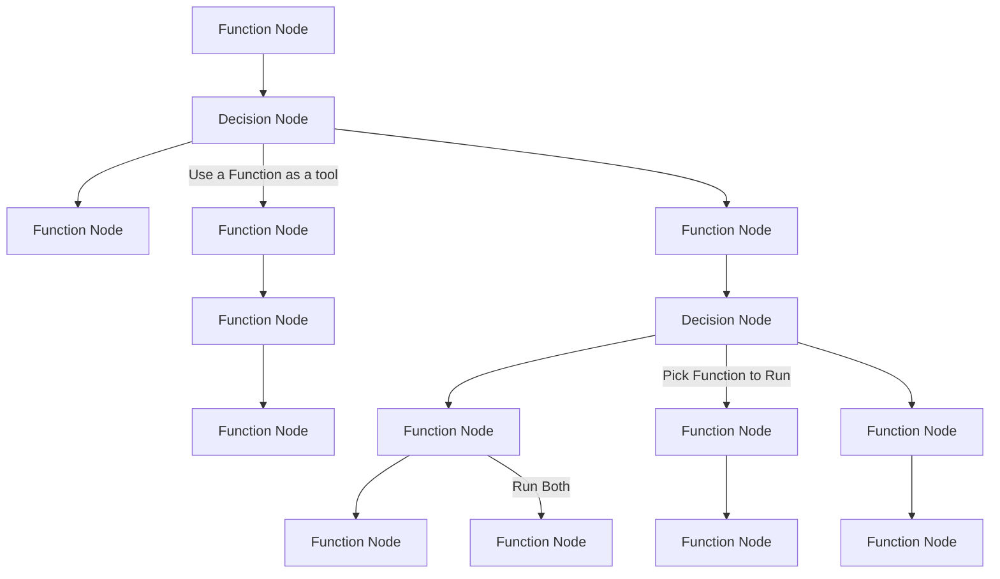

# DAGent - Directed Acyclic Graphs (DAGs) as AI Agents


*DAGent is a Python library to create AI Agents without overhead*

## Quickstart

### Install the lib 
`pip install dagent`


### DAGent Diagram


The idea behind dagent is to structure AI agents in to a workflow. This is done through setting each function up as a node in a graph. 

The agentic behavior is through the inferring of what function to run through the use of LLMs which is abstracted by a "Decision Node".

### DAGent basics 

`DecisionNode`
- This is where the llm picks a function to run from given options
- The `.compile()` method autogenerates and saves tool descriptions under Tool. Run with param `force_load=True` if there are errors or if an option of tool changes
- These tool/function descriptions get generated in 

`FunctionNode`
- Runs a python function
- Can be attached to a `DecisionNode` to be treated as a tool and allow an LLM to choose which function to run 


### Example Usage
See [dagent/examples/simple_agent.py](dagent/examples/quickstart_simple_agent.py) for more info


## Using Different Models

DAGent supports using different LLM models for inference and tool description generation. You can specify the model when calling `call_llm` or `call_llm_tool`, or when compiling the DecisionNode.

For example, to use the `groq/llama3-70b-8192` model:

```python

# Using groq with decision node
decision_node1 = DecisionNode('groq/llama3-70b-8192')

# Using ollama with decision node
decision_node2 = DecisionNode('ollama_chat/mistral', api_base="http://localhost:11434")

# Call llm function
output = decision_node2.run(messages=[{'role': 'user', 'content': 'add the numbers 2 and 3'}])

```

### Other things to know

- `prev_output` is needed in the function signature if you want to use the value from the prior function's value. Obviously the prior function should have returned something for this to work
- If there are errors with too many params being passed into a function node, add **kwargs to your function 
- Args can be overriden at any time using the following (this merges the kwargs in the background with priority to the user):
```python
add_two_nums_node.user_params = {
    a : 10
}
```


## Acknowledgements 
Shoutout to:
- [@omkizzy](https://x.com/omkizzy)
- [@kaelan](https://github.com/Oasixer)
